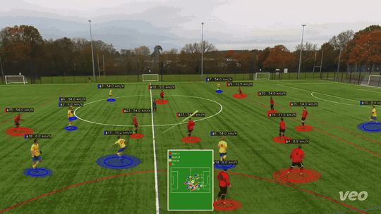
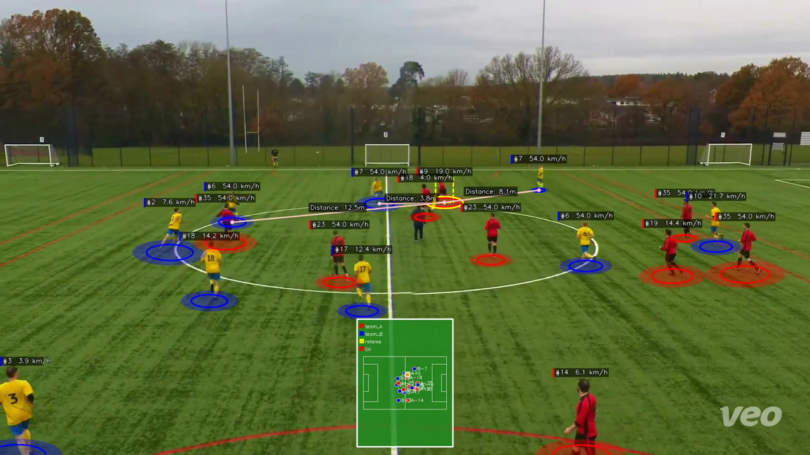

# GoalInsight

[](LICENSE)
[](https://www.python.org/)
[](https://github.com/astral-sh/ruff)

End-to-end pipeline that turns a single fixed-camera soccer video into player tracks, events, and watchable highlight clips — with an LLM chat interface on top of the resulting match data.



> **Status: research-grade.** Built on weekends to make my kid's grassroots-league recordings interesting to watch. It works on the cameras I have (Veo, GoPro, phone tripods); it has not been hardened for arbitrary footage.

## Why

If you've ever recorded a youth soccer match on a fixed camera, you know the problem:

- The video is 60–90 minutes long, the action is 20% of that, and finding the goal you actually want to re-watch means scrubbing.
- Pro broadcasters get tracking data, event tags, and slow-mo replays for free; amateur footage gets none of that.
- Commercial services (Veo, Pixellot, Trace) are great but closed, expensive per-team, and don't let you ask questions like "how far did number 9 actually run today?"

GoalInsight runs entirely on your own machine (or on AWS if you want GPUs you don't own), gives you the same kinds of artifacts a broadcaster's stack produces — calibration, tracks, events, highlight clips — and exposes them through a chat interface so you can ask things like "show me every shot from team A in the second half" and get back clickable seek tags.

It's also a deliberate sandbox for putting modern Bedrock + AgentCore tool-use against a non-trivial domain dataset.

## What it does

```
Raw fixed-camera video
        │
        ▼
┌──────────────────┐    Field registration: find where the camera is in the
│ Calibration      │    world. Five backends (PnLCalib HRNet, BroadTrack,
│ (camera + pitch) │    NBJW, fixed-intrinsic Physical, plain Homography);
└──────────────────┘    pick by config based on what your footage looks like.
        │
        ▼
┌──────────────────┐    Players: YOLOv8 detection → ByteTrack/BOTSORT →
│ Tracking         │    OSNet/PRTReID re-identification → k-means or
│ (players + ball) │    tracklet team classification.
└──────────────────┘    Ball: YOLO class 32 + center-distance ByteTrack +
        │               two-pass segment classification (ground-roll vs
        ▼               airborne) and per-segment 3D fitting.
┌──────────────────┐    Possession state machine → pass / shot / carry /
│ Events           │    tackle / interception detectors. Shot detector
│ (rule-based      │    subsumes goal detection (Goal/Saved/Off_Target/
│  detectors)      │    Blocked outcomes with shooter attribution).
└──────────────────┘
        │
        ▼
┌──────────────────┐    Recipe-based: an event detector, an analyzer that
│ Highlights       │    plans 4 segments (buildup → strike → celebration →
│ (per goal)       │    replay), and a composer that crops/zooms per
└──────────────────┘    segment, draws the shooter spotlight + ball trail,
        │               and produces an MP4 with optional video2x upscaling
        ▼               + RIFE slow-motion replay.
┌──────────────────┐    FastAPI viewer + Bedrock-backed chat with five
│ Web chat         │    tools (list_events, get_player_stats,
│ (analytics on    │    get_team_stats, get_frame_snapshot, run_python in
│  the run)        │    an AgentCore Code Interpreter sandbox).
└──────────────────┘
```

A still from the tracking stage (annotated player + ball detections, with team colors and IDs):



## Quick start

The supported way to run GoalInsight is a self-contained Docker image
that ships the full pipeline plus a FastAPI web UI (library / pipeline
launcher / match viewer / annotator). No repo clone, no AWS account,
no manual model downloads.

**Host requirements**

| Item | Requirement |
|------|-------------|
| OS | Linux (Ubuntu 22.04+) or Windows + WSL2 |
| GPU | NVIDIA, ≥ 16 GB VRAM (Qwen VL for jersey OCR + YOLOv8x + CLIP-ReID), driver 530+ |
| Docker | 24.0+ with `nvidia-container-toolkit` installed |
| Disk | ~50 GB for the image; ~3 GB per pipeline run output |
| **Mac** | Docker on Mac can't reach an NVIDIA GPU — **not supported**. Run on a Linux host or rent a cloud GPU (Lambda Labs / Vast.ai). |

**Build the image** (one time, ~15 min on first build; needs the fine-tuned
CLIP-ReID weights at `workspace/models/ViT-L-14_openai/Paper/weights_e4.pth`
and a short demo video at `workspace/videos/`):

```bash
./deploy/offline/build.sh
```

**Launch the web app**:

```bash
mkdir -p workspace
docker run -d --name gi --gpus all \
    -p 8000:8000 \
    -v "$PWD/workspace:/workspace" \
    goalinsight:offline-latest
# Open http://localhost:8000/library in your browser.
```

On first launch the container's entrypoint:
- Seeds `workspace/configs/` with `fifa.yaml` / `futsal.yaml` / `children.yaml`
  starter templates you can pick from the Library.
- Background-launches a local Qwen VL vLLM daemon on port 8100 so the
  track_consolidation stage's jersey OCR works offline. Cold-start on
  first container start-up takes 3–5 min (flashinfer JIT compile);
  subsequent restarts warm up in ~30 s.

**Workflow through the web UI**

1. `/library` → drop a video into the upload zone. A scene-setup wizard
   auto-opens: pick pitch type + camera profile, choose fixed rig vs
   pan/tilt/zoom, and (for fixed rigs) type the physical camera position.
2. For fixed rigs the wizard opens the annotator in a new tab; mark
   ≥4 pitch keypoints, click *Compute*, *Save*, and return to the
   wizard.
3. Back on step 4 of the wizard, pick which visualizations to write
   (field-reg / tracking / ball diag) and optionally toggle *Player
   profile* (heatmaps + spotlight clips, +~50 s). Click *Launch
   pipeline*.
4. The Pipeline tab shows per-stage progress and vis outputs; the
   Match tab shows events + roster + minimap.

End-to-end runtime on a 10-second futsal clip:

```
field_registration:   0.5 s   (fixed-rig short-circuit, replays annotation pose)
tracking:            32   s   (YOLOv8x + StrongSORT + CLIP-ReID)
track_consolidation: 33   s   (Qwen VL jersey OCR, vLLM daemon already warm)
event_detection:      3   s
─────────────────────────────
total:                ~70 s   (add ~50 s if you enable player_profile)
```

**Sharing the image**

```bash
# Option A: push to a container registry
docker tag goalinsight:offline-latest <your-registry>/goalinsight:offline-latest
docker push <your-registry>/goalinsight:offline-latest

# Option B: ship a tarball
docker save goalinsight:offline-latest | gzip > goalinsight-offline.tar.gz
# receiver:
docker load -i goalinsight-offline.tar.gz
```

More detail (image layout, jersey-OCR backend swap to Claude/Gemini,
troubleshooting, license inventory):
[`deploy/offline/README.md`](deploy/offline/README.md).

## CLI flags

| Flag | Default | Description |
|------|---------|-------------|
| `--video` | required | Source video path. |
| `--output` | required | Run output directory. |
| `--config` | required | YAML config file (deep-merged onto `configs/default.yaml`). |
| `--stages` | `field_registration,tracking` | Comma-separated subset of `field_registration,tracking,track_consolidation,event_detection,player_profile,highlights,annotated_video`. `track_consolidation` must precede `event_detection` so events carry stable `A-9`-style player_ids. |
| `--no-viz` | off | Skip the tracking visualization video (saves time and memory). |
| `--keypoint-model` | from config | Override `field_registration.keypoint_model_path`. |
| `--remote-stages` | `none` | Comma-separated stages to run on SageMaker instead of locally (see [SageMaker](#sagemaker-remote-execution-optional)). |
| `--skip-existing` | off | Skip a stage if its output already exists. Useful for partial reruns. |
| `--run-name` | `<config-name>` | Name segment in the output dir. |
| `--no-timestamp` | off | Don't append a timestamp to the run dir. |

## Configuration

Configs in `configs/` override `configs/default.yaml`. The presets that ship:

- `clip_000_finetuned.yaml` — recommended starting point. PnLCalib (finetuned HRNet keypoint+line detector) on broadcast-style footage.
- `clip_000_broadtrack.yaml` — BroadTrack backend (9-parameter camera + Cauchy robust loss + arc-length line constraints). Better on heavy lens distortion.
- `clip_000_physical.yaml` — Fixed-intrinsic camera profile from `camera_profiles.yaml` (e.g. Veo). 7-DOF bounded extrinsics. The most stable backend on non-FIFA pitches.
- `clip_000_homography.yaml` — Plain ground-plane DLT homography. Fast baseline.
- `kids_soccer*.yaml` — Variants tuned for non-FIFA-spec youth pitches (smaller, different goal width).

Key knobs (full list in `configs/default.yaml`):

```yaml
field_registration:
  backend: pnlcalib       # pnlcalib | broadtrack | nbjw | physical | homography
  keypoint_threshold: 0.5
  ransac_threshold: 30    # px

video:
  process_fps: 5          # frame sample rate

detection:
  model: yolov8x.pt

reid:
  backend: osnet          # osnet | prtreid
team_classification:
  backend: kmeans         # kmeans | tracklet
jersey_recognition:
  backend: qwen           # qwen (VLM) | mmocr (DBNet+SAR)

events:
  detectors: [possession, pass, shot, carry, defensive]

highlights:
  recipes: [...]
video_enhancement:
  enabled: false          # video2x upscaling + RIFE slow-mo
  mode: docker            # binary | docker
```

## SageMaker remote execution (optional)

`field_registration` and `tracking` are GPU-bound. They can run on a SageMaker Processing Job (`ml.g5.xlarge`, ~$1.41/hr) instead of locally; the rest of the pipeline still runs on your workstation.

One-time setup:

```bash
bash sagemaker/setup_aws.sh        # creates IAM role, ECR repo, S3 bucket
bash sagemaker/upload_weights.sh   # pushes finetuned weights to S3
bash sagemaker/build_and_push.sh   # builds and pushes the container image
```

Copy the `sagemaker:` block printed by `setup_aws.sh` into `configs/default.yaml`. Then opt in per-run:

```bash
goalinsight --video clip.mp4 --output output/ --config configs/kids_soccer.yaml \
            --remote-stages field_registration,tracking
```

A 10-minute clip costs ~$0.10 wall-clock-equivalent. Full notes in [`sagemaker/README.md`](sagemaker/README.md).

## Web viewer + chat

```bash
python -m goalinsight.web --workspace ./workspace
# default: http://127.0.0.1:8000/
```

A unified workspace UI: pipeline launcher (`/pipeline`), per-stage results
viewer, single-run video viewer + chat (`/insights/<run>`), tracking
diagnostics (`/tracking/<run>`), pitch annotator (`/annotate`), and a
library of videos / runs (`/library`). Runs live under
`<workspace>/runs/<run-name>/`; videos under `<workspace>/videos/`. Use
symlinks to point an existing `output/` tree at `<workspace>/runs`.

The viewer streams the match video alongside a Bedrock-backed chat. The model has five tools:

- `list_events` — filter events by type/team/player/time window
- `get_player_stats` — per-player distance, top speed, touches, passes, shots, goals
- `get_team_stats` — possession share, pass success, shots, tackles, interceptions
- `get_frame_snapshot` — who's on screen and what's near the ball at a moment
- `run_python` — execute Python in an AgentCore Code Interpreter sandbox for ad-hoc analysis (heatmaps, custom aggregations); plots come back as inline images

Example questions that work today:

> "How far did A-9 run? When did they have their best chance?"
> "Compare B-10's first-half and second-half pass success rate."
> "Plot a heatmap of where team A's possessions ended."

### Optional: chat on AgentCore Runtime

The chat agent can also run as an AWS-managed AgentCore Runtime
container instead of inside the FastAPI process — same prompts, same
tools, same SSE shape on the wire. The local app proxies turns to the
runtime via `bedrock-agentcore.InvokeAgentRuntime` and streams the
response back to the browser unchanged. Setup, deploy, and per-run S3
sync are documented in [`deploy/agentcore_runtime/README.md`](deploy/agentcore_runtime/README.md);
toggle by setting `GOALINSIGHT_AGENTCORE_RUNTIME_ARN` (and unset to
revert to local chat).

## Repository layout

```
goalinsight/
  cli.py                     # CLI entry (-> goalinsight)
  pipeline/                  # stage framework, registry, adapters, remote
  field_registration/        # 5 calibration backends + finetune machinery
  tracking/                  # detection, ByteTrack, ReID, ball detector + 3D
  events/                    # detector framework + possession/pass/shot/...
  highlights/                # MatchContext + recipe agents
  annotation/                # Gradio-based pitch keypoint annotator
  web/                       # FastAPI viewer + Bedrock chat
  jersey/                    # OCR + VLM jersey-number recognizers
  video_enhancement/         # video2x wrapper (binary or docker mode)
  utils/, interfaces/        # factories + ABCs
configs/                     # default + per-clip + camera profiles
sagemaker/                   # setup, build, weights upload, entrypoint
deploy/offline/              # self-contained Docker image for sharing
                             # the offline pipeline (see Offline pipeline
                             # section above)
deploy/agentcore_runtime/    # optional AgentCore Runtime image for chat
scripts/                     # run_full_pipeline, pipeline.sh, audit/dump tools, ...
tools/                       # make_comparison.py and other utilities
docs/                        # architecture diagrams (draw.io)
```

## Architecture quick links

- Full pipeline & AWS architecture diagram → [`docs/goalinsight-aws-architecture.drawio`](docs/goalinsight-aws-architecture.drawio)
- SageMaker-only zoom → [`docs/goalinsight-sagemaker-deployment.drawio`](docs/goalinsight-sagemaker-deployment.drawio)
- Internal architecture deep-dive → [`CLAUDE.md`](CLAUDE.md) (kept up-to-date as a guide for AI coding assistants and humans alike)

## Development

```bash
# Run individual diagnostic / experimentation scripts
python scripts/run_full_pipeline.py [same flags as goalinsight]
python scripts/run_highlights.py --run-dir output/<run>

# Per-backend quick run scripts
bash scripts/pipeline.sh             # PnLCalib finetuned
bash scripts/pipeline_broadtrack.sh
bash scripts/pipeline_physical.sh

# Finetune the PnLCalib heads (after annotating frames)
# see goalinsight/field_registration/pnlcalib/finetune_*.py
```

There is no formal test suite. Test/debug scripts at the repo root use the `test_*.py` / `debug_*.py` naming convention and are gitignored.

## Security

This is a single-user research tool. The defaults are safe; the configurable footguns are documented:

- **`python -m goalinsight.web` binds to `127.0.0.1` and ships without authentication.** Intended for local single-user use. If you pass `--host 0.0.0.0` to expose it on a network, add your own authentication layer (nginx + basic auth, SSH port-forwarding, etc.).
- **The chat `run_python` tool executes arbitrary Python in an AWS Bedrock AgentCore Code Interpreter sandbox.** The sandbox is AWS-managed, but token usage and sandbox session minutes are billed against the AWS account whose credentials are picked up from the default credential chain.
- **Pipeline calibration outputs (`homographies.pkl`, `camera_poses.pkl`) are pickle files.** Do not load pipeline output directories you didn't produce yourself — pickle deserialization is RCE-equivalent. A safer on-disk format is on the roadmap.
- **`video_enhancement.mode: docker` runs `ghcr.io/k4yt3x/video2x` with `--gpus all` and a host-directory volume mount.** Filenames and config arguments are now `shlex.quote`'d before reaching `bash -c`, but the container itself runs as root.
- **The SageMaker execution role created by `sagemaker/setup_aws.sh` uses `AmazonS3FullAccess` for ergonomic setup.** Production deployments should narrow this to a bucket-scoped inline policy; the script flags this in a comment.
- **Model weights downloaded from PnLCalib's GitHub releases are unpickled by `torch.load(weights_only=False)`.** `weight_downloader.py` now SHA-256-verifies downloads when the hash is pinned in `AVAILABLE_WEIGHTS`; the `sha256` fields ship empty so first-time use logs the hash for you to pin.

## Acknowledgements

- [PnLCalib](https://github.com/mguti97/PnLCalib) — vendored as the calibration baseline (HRNet keypoint+line detector + iterative PnP). Original paper: Gutiérrez-Pérez & Agudo, "PnLCalib: Sports Field Registration via Points and Lines Optimization", 2024.
- [BroadTrack](https://github.com/cmu-rim/broadtrack) — alternative camera model with arc-length line constraints.
- [video2x](https://github.com/k4yt3x/video2x) — Real-ESRGAN + RIFE wrapper used for highlight clip enhancement.
- [Ultralytics YOLO](https://github.com/ultralytics/ultralytics), [TorchReID](https://github.com/KaiyangZhou/deep-person-reid) for detection and re-identification.
- The clean state-machine event detector design is adapted from [SoccerNet-v3](https://www.soccer-net.org/)'s event taxonomy.

## License

[Apache License 2.0](LICENSE). Copyright © 2024–2026 Tang Jie.

The vendored PnLCalib reference port under `goalinsight/field_registration/pnlcalib/` retains its upstream license (see header in those files).

## Contributing

Issues and pull requests are welcome. The code is research-grade and the seams between stages are intentionally explicit so a contributor can swap in (say) a different ReID model or calibration backend without touching the rest of the pipeline. See `CLAUDE.md` for the architectural details.
