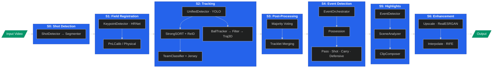

# GoalInsight Architecture

```mermaid
%%{init: {'theme': 'dark', 'flowchart': {'nodeSpacing': 16, 'rankSpacing': 28, 'padding': 12}}}%%
flowchart LR
    VIDEO[/"Input Video"/]

    subgraph S0["S0: Shot Detection"]
        SD["ShotDetector → Segmenter"]
    end

    subgraph S1["S1: Field Registration"]
        direction TB
        S1_KP["KeypointDetector · HRNet"]
        S1_BE["PnLCalib / Physical"]
        S1_KP --> S1_BE
    end

    subgraph S2["S2: Tracking"]
        direction TB
        S2_DET["UnifiedDetector · YOLO"]
        S2_PT["StrongSORT + ReID"]
        S2_BT["BallTracker → Filter → Traj3D"]
        S2_TA["TeamClassifier + Jersey"]
        S2_DET --> S2_PT --> S2_TA
        S2_DET --> S2_BT
    end

    subgraph S3["S3: Post-Processing"]
        direction TB
        S3_MV["Majority Voting"]
        S3_TM["Tracklet Merging"]
        S3_MV --> S3_TM
    end

    subgraph S4["S4: Event Detection"]
        direction TB
        S4_OR["EventOrchestrator"]
        S4_PS["Possession"]
        S4_EV["Pass · Shot · Carry · Defensive"]
        S4_OR --> S4_PS --> S4_EV
    end

    subgraph S5["S5: Highlights"]
        direction TB
        S5_DT["EventDetector"]
        S5_AN["SceneAnalyzer"]
        S5_CP["ClipComposer"]
        S5_DT --> S5_AN --> S5_CP
    end

    subgraph S6["S6: Enhancement"]
        direction TB
        S6_UP["Upscale · RealESRGAN"]
        S6_FI["Interpolate · RIFE"]
        S6_UP --> S6_FI
    end

    VIDEO --> S0 --> S1 --> S2 --> S3 --> S4 --> S5 --> S6 --> OUTPUT[/"Output"/]

    classDef stage fill:#2563eb,stroke:#1e40af,color:#fff,font-weight:bold
    classDef io fill:#059669,stroke:#047857,color:#fff
    class S0,S1,S2,S3,S4,S5,S6 stage
    class VIDEO,OUTPUT io
```
