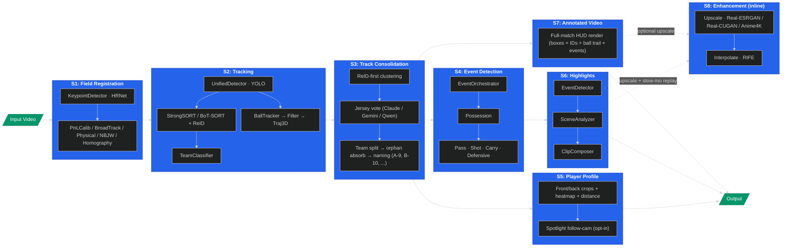

# GoalInsight Architecture

The pipeline runs as a config-driven chain of stages registered in
`goalinsight/pipeline/_adapters.py` via `@register_stage`. The order is
controlled by `pipeline.stages` in the YAML config. `track_consolidation`
must precede `event_detection` so events carry stable `player_id`s
(`A-7`) instead of raw track integers. `player_profile`, `highlights`,
and `annotated_video` are independent leaves that all consume the
consolidated tracks. Video enhancement (`video2x` upscaling + RIFE
interpolation) is invoked inline from the highlights composer and the
annotated-video renderer, not as a standalone stage.

A web app (`goalinsight/web/`) sits on top of the run output: FastAPI
viewer + Bedrock-backed chat with five tools (`list_events`,
`get_player_stats`, `get_team_stats`, `get_frame_snapshot`, `run_python`
in an AgentCore Code Interpreter sandbox). The chat agent can optionally
run inside an AgentCore Runtime container instead of in-process — see
[`deploy/agentcore_runtime/README.md`](deploy/agentcore_runtime/README.md).

For the rendered AWS-architecture views (chat path, local pipeline,
remote SageMaker pipeline) see
[`docs/architecture/`](docs/architecture/README.md).
