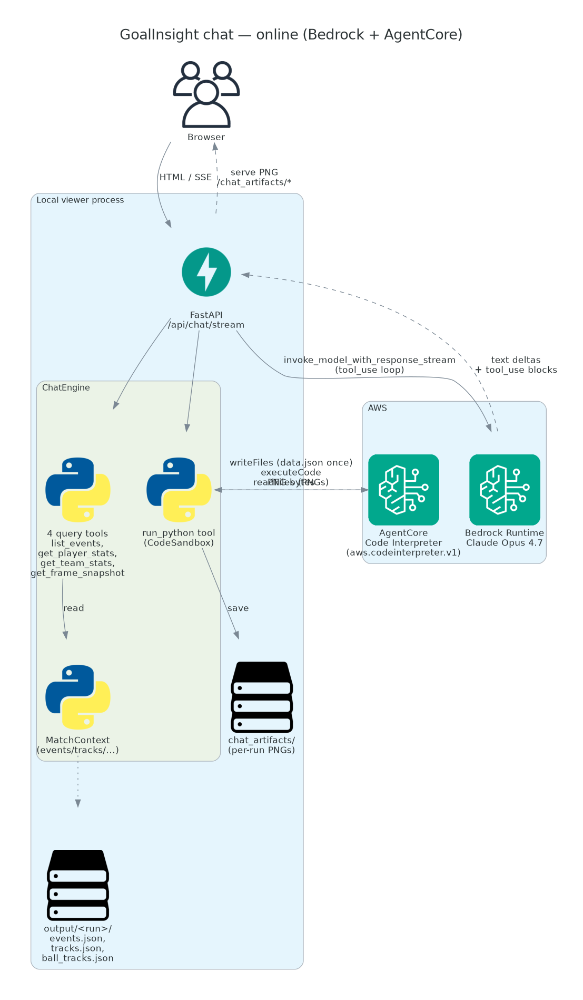
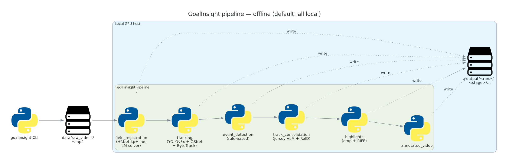
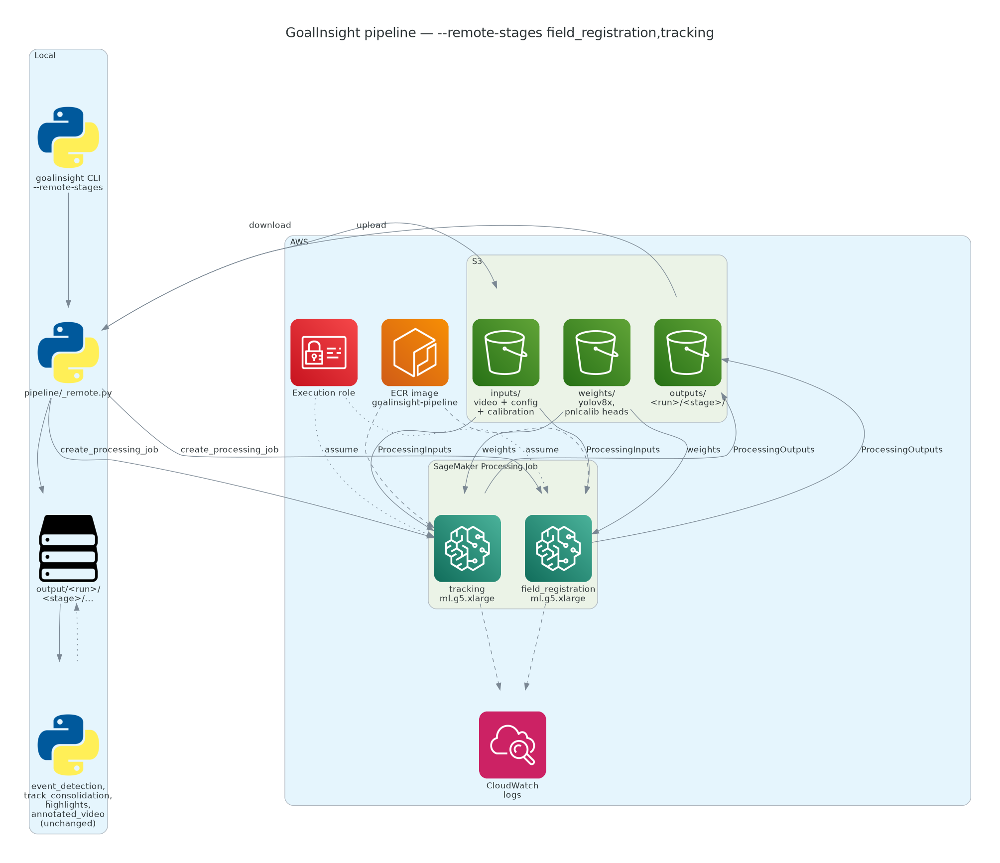

# Architecture diagrams

Three views of how the system fits together. Generated from
[`render.py`](render.py) using the [`diagrams`](https://diagrams.mingrammer.com/)
library + graphviz, so you get real AWS icons and the source-of-truth
is code rather than a draw.io file someone has to find.

## Regenerating

```bash
sudo apt install graphviz                 # one-time
pip install diagrams                      # one-time
python docs/architecture/render.py
```

## Views

### Online — chat / viewer (Bedrock + AgentCore)



The browser hits a local FastAPI process; the chat engine runs a
tool_use loop with Bedrock, where four query tools resolve against an
in-memory `MatchContext` (events / tracks / ball) and `run_python`
delegates to AgentCore Code Interpreter for ad-hoc analysis. The only
things that leave the box are LLM tokens and Python snippets — match
data stays local.

### Offline — pipeline default (all local)



Six stages in a long chain, each writing into `output/<run>/<stage>/`
and reading the previous stage's products. Default behavior: no AWS
contact unless jersey recognition is configured to use Claude/Gemini.

### Offline — `--remote-stages field_registration,tracking`



Field registration and tracking offload to a SageMaker Processing Job
backed by an ECR image and S3-hosted weights. The local
`pipeline/_remote.py` uploads inputs, submits the job, polls, and
downloads the allow-listed products into the same directory layout the
local stages would have produced. Downstream stages
(event_detection, track_consolidation, highlights, annotated_video)
keep running locally — they don't know whether the upstream stages
ran on the host or on SageMaker.
